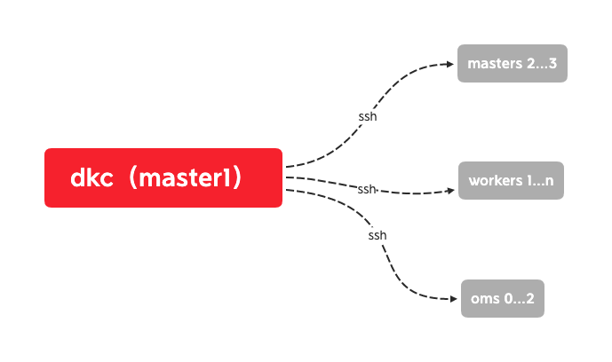
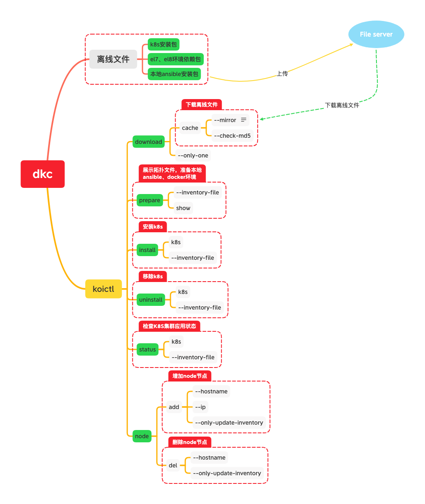

#### 说明

dkc项目旨帮助kubernetes小白在centos 7.9.2009上快速安装kubernetes v1.20.7

安装剧本使用kuberspray项目: version 2.16.0

所需要的k8s安装文件都通过download命令下载

#### 使用场景

1. 服务器系统为centos 7.9.2009 [下载地址](http://isoredirect.centos.org/centos/7/isos/x86_64/)

1. 服务器中任意节点作为dkc运行节点 


#### 功能设计



#### 使用方式

注: 第1-3步,可以在linux/windows/macos系统操作, 第4步安装过程和增删节点必须在服务器节点上执行.

1. 在release页面下载dkc.tar.gz, 解压, [demo地址](http://dkc.k8sfans.com:5555)
2. 下载k8s相关的离线文件,
```shell script
./dkc download cache
```
3. 开启web界面,访问localhost:5555编辑拓扑文件,下载hosts.yaml,并放在inventory目录
```shell script
./dkc web
```
4. 安装kubernetes
```shell script
./dkc install k8s
```
5. 增加节点
```shell script
./dkc node add --hostname <hostname> --ip <ip>
```
6. 删除节点
```shell script
./dkc node del --hostname <hostname> 
```
7. 检查kubernetes
```shell script
./dkc status k8s
```

8. 删除kubernetes
```shell script
./dkc uninstall k8s
```